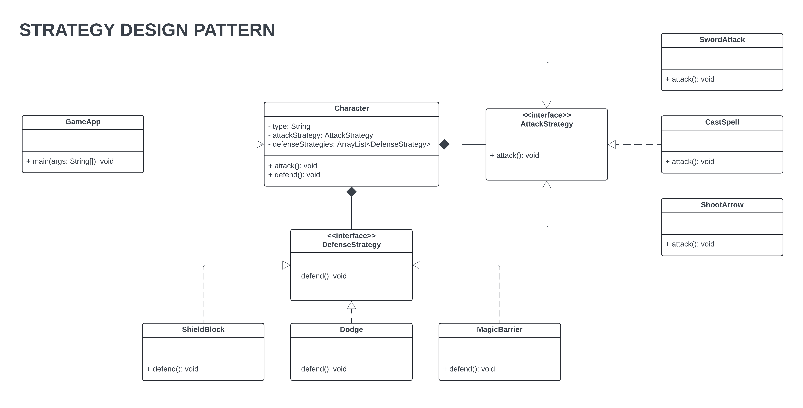

# Laboratory Assignment 1
This is Laboratory Assignment 1 for the course, Software Engineering 2, taken during the Second Semester of Academic Year, 2025-2026, at New Era University.

## Problem Statement

 Suppose we have three types of characters in a GameApp: 

<ol>
  <li>Knight: Attacks with a sword; uses 3 strategies to defend (shield, dodge, magic barrier)</li>
  <li>Wizard: Casts spells; uses magic barrier to defend</li>
  <li>Archer: Shoots arrows; uses dodge to to defend</li>
</ol>

Implement two types of Strategy:

<b>A. DefenseStrategy</b>
<ol>
  <li>Shield</li>
  <li>Dodge</li>
  <li>CreateMagic</li>
</ol>

<b>B. AttackStrategy</b>
<ol>
  <li>CastSpell</li>
  <li>ShootArrow</li>
  <li>SwingSword</li>
</ol>

Refactor the existing code and provide the UML diagram

    public class Character {
    private String type;

    public Character(String type) {
        this.type = type;
    }

    public void attack() {
        if (type.equals("Knight")) {
            System.out.println("Knight attacks with a sword!");
        } else if (type.equals("Wizard")) {
            System.out.println("Wizard casts a spell!");
        } else if (type.equals("Archer")) {
            System.out.println("Archer shoots an arrow!");
        }
    }

    public void defend() {
        if (type.equals("Knight")) {
            System.out.println("Using a shield to defend!");
    System.out.println("Dodgin to avoid attack!");
            System.out.println("Creating a magic barrier for defense!"");		

        } else if (type.equals("Wizard")) {
            System.out.println("Creating a magic barrier for defense!"");
        } else if (type.equals("Archer")) {
            System.out.println("Using a shield to defend!"");
        	}
    	}
	}

## Class Diagram

